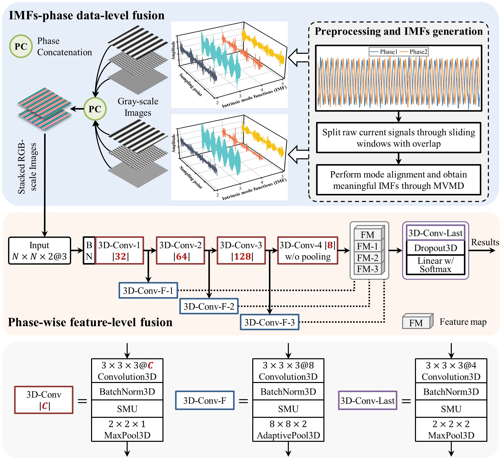

# 3D-HFN for Current-based Bearing Fault Diagnosis



<p align="left"> 
    <a href="https://www.python.org/">
        </a> 
    <a href="https://pytorch.org/">
        </a>
    <a href="https://in.mathworks.com/products/matlab.html">
        </a>
    <a href="LICENSE">
        </a>
    <a href="https://dx.doi.org/10.1088/1361-6501/ad099b">
        </a>
</p>


This repository contains source code for MST paper "Three-Dimensional Hybrid Fusion Networks for Current-based Bearing Fault Diagnosis". 

Codes are run on `Ubuntu 22.04` with `an Nvidia RTX 2080 GPU`. 

## Citation

If this project useful for your research, please cite the original journal paper with the following BibTex entry.

```
@article{10.1088/1361-6501/ad099b,
doi = {10.1088/1361-6501/ad099b},
url = {https://dx.doi.org/10.1088/1361-6501/ad099b},
year = {2023},
month = {nov},
publisher = {IOP Publishing},
volume = {35},
number = {2},
pages = {025126},
author = {Xufeng Huang and Tingli Xie and Jiexiang Hu and Qi Zhou},
title = {Three-dimensional hybrid fusion networks for current-based bearing fault diagnosis},
}
```

